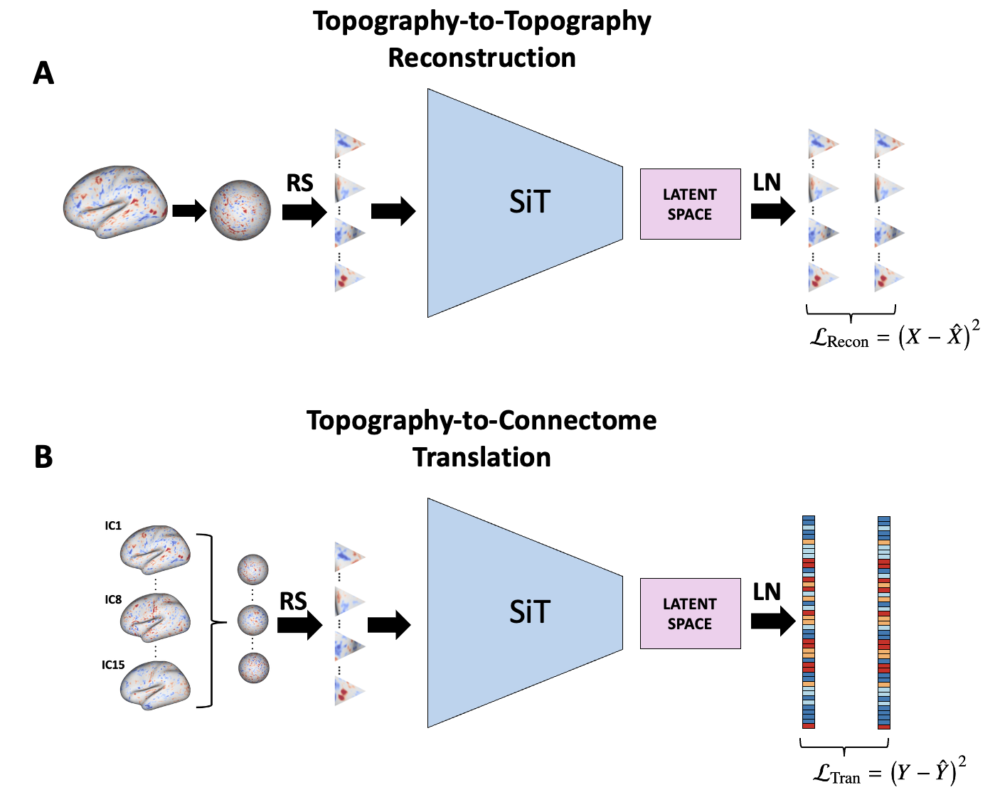

# Topography-to-Connectome Transaltions

For further details on preparing surfaces and general SiT code, see [Simon Dahan's GitHub repo about SiT](https://github.com/metrics-lab/surface-vision-transformers).

<!-- ### 
This repo is largely based off of previous work from others, namely the Surface image Transformer code from Dahan et al., 2022 (https://arxiv.org/abs/2203.16414 & https://arxiv.org/abs/2204.03408) with original repo at: https://github.com/metrics-lab/surface-vision-transformers
This repo is contains scripts to apply various deep learning models that attempt to translate from one brain representaion to another. **So far, only the trasnlation from MRI brain meshes to functional connectivity matrices is actively being worked on**. As such, the current README will only walk through this translation process. -->



## Updates
<details>
    <summary><b> V.1.0.0</b></summary>
    Initial commits on JAN-17-2026
    <ul type="circle">
        <li> First version of the topography-to-connectome translator architecture. Still needs work on some areas and will be streamlined soon. (1) Walks user through preparing the CIFTI files of resampled surface cortical data. (2) Has *.yml files used for hyperparameter tuning and preparing the CIFTI files. (3) Trans and tests models (option to do it in the same sequence of steps or sepeately). (4) Has regular python and jupyter notebook scripts that also walk the user through visualizations and downstream analyses. </li>
    </ul>
</details>

<!-- <details>
    <summary><b> V.1.0.0 </b></summary>
    Major codebase update - 04.03.24
    <ul type="circle">
        <li> Adding ICA mesh -> Schaeffer netmat translation</li>
        <li> Modifying preprocessing script (curr no normalization of ico sphere data) </li>
        <li> ingle config file tasks (surf2mat) and data configurations (template because we use HCP mesh template)</li>
        <li> adding mesh indices to extract non-overlapping triangular patches from a cortical mesh ico 6 sphere representation</li>
        <li> training script </li>
        <li> README </li>
        <li> config file for training </li>
    </ul>
</details> -->

## Installation & Set-up

**Python and minionda**

Make sure you have python and miniconda. Create an env:

```
conda env create -f environment.yml
```

You may also use the text file options:

```
pip install -r requirements.txt
```

```
conda create --name <env_name> --file requirements.txt
```

I got these from a [stackoverflow message board](https://stackoverflow.com/a/55687210) posted by onlyphantom.

You can call it what you want. To do so, change the name in the `environment.yml` file. Also, if `-f` fails, you can try `--file=environment.yml` instead.

## Resampling native cortical sheet to ICO-06 spheres
Data in this projects is expexted to come from some MRI brain representation. For now, it is limited to TWO kinds of brain representations: (1) ICA activation maps on a resmapled cortical sheet [Beckmann & Smith (2004)](https://ieeexplore.ieee.org/document/1263605);[Nickerson et al. (2017)](https://www.frontiersin.org/journals/neuroscience/articles/10.3389/fnins.2017.00115/full) & (2) connectomes of functional connectivity. We used the ABCD cohort and so you will need CIFTI data. We used the MELODIC tool from FSL toolbox to get group ICA maps for our dataset. Then applied dual regression to get individual ICA maps of dimension 15. This repo assumes the connectomes and ICA maps were already computed. For the ICA maps, we will extract both hemispheres. It is assumed that each individual subject has a surf.dscalar.nii file. Go to `./tools/chpc_resample_sphere_fs_space.sh` for how we extract LEFT and RIGHT hemispheres from each subject file.

Briefly, we used [workbench](https://www.humanconnectome.org/software/get-connectome-workbench) to create the ICO-06 (|V|=32492) spheres to resample subject data onto. 

```
wb_command -surface-create-sphere 32492 naranjo_ico.R.surf.gii
wb_command -surface-flip-lr naranjo_ico.R.surf.gii naranjo_ico.L.surf.gii
wb_command -set-structure naranjo_ico.R.surf.gii CORTEX_RIGHT
wb_command -set-structure naranjo_ico.L.surf.gii CORTEX_LEFT
```  

We then resample the subject file into this ICO-06 sphere for later preprocessing. This and all subsequent instructions will show LEFT hemisphere only. You can jsut repeat the process for RIGHT hemisphere if needed.

```
id_num=1234 #example subjectID
wb_command -metric-resample "${id_num}_subj_L_cortex.shape.gii" naranjo_ico.L.surf.gii "${path_to_surface}/surfaces/ico-6.L.surf.gii" BARYCENTRIC "resamp_${id_num}.L.shape.gii"
```

The `./data/chpc_resample_sphere_fs_space.sh` script is meant to be used to conver brain maps of contained in the brain_representation folder into left and right spheres that represent left and right cortex, respectively. For us, these are ICA brain maps.

info can be found in:
1. https://manpages.debian.org/testing/connectome-workbench/wb_command.1.en.html#Maps
2. https://www.humanconnectome.org/software/workbench-command/-surface-create-sphere
3. https://www.humanconnectome.org/software/workbench-command/-metric-resample


## Preparing Spheres (Tesselating into ICO-N spheres)
We will be resampling these large spheres into ico-2 spheres of 320 patches with 153 veteces each. the `./tools/preprocessing.py` script is meant to do this, given a config yaml file in `./config/resampling_sphere_prep/*.yml`. Example:

```
source activate neurotranslate
python3 ./tools/preprocessing.py ./config/resampling_sphere_prep/ICAd15_schfd100.yml 
```

The above code will preprocess the ICAd15 spheres to prep them for a Schaeffer 100 translation.

<!-- ## Accessing Processed data -->
<!-- <details>
    <summary><b> How to access the processed data?</b></summary>
    <p>
    To access the data please:
    <br>
        <ul type="circle">
            <li>Sign in <a href="https://data.developingconnectome.org/app/template/Login.vm">here</a> </li>
            <li>Sign the dHCP open access agreement </li>
            <li> Forward the confirmation email to <b> slcn.challenge@gmail.com</b>  </li>
        </ul>
    </br>
    </p>
</details> -->

## Training 
For training a SiT model, use the following command:

```
python3 ./tools/SiT_LN/top2conn_train.py ./config/SiT_LN/hparams_SiTLN_recon.yml
```

We run our scripts through a SLLURM computing node(s) and so we send jobs as follows:
```
sbatch ./tools/SiT_LN/submit_top2conn_train_recon.sh
```
You can edit this for the job submission requirements you need.

Where all hyperparameters for training and model design models are to be set in the yaml file `./config/SiT_LN/hparams_SiTLN_recon.yml`, such as: 
- Transformer architecture options
- Training strategy: from scratch only for now
- Optimisation strategy
- Patching Configuration
- Logging Paths

## Testing
When a model is trained, there is an option in the config file for testing immediately after, but to test seperately or test other models:

```
python3 ./tools/SiT_LN/top2conn_test.py ./config/SiT_LN/hparams_SiTLN_recon.yml
```
Or, again, submit to a SLURM job or something like it:

```
sbatch ./tools/SiT_LN/submit_top2conn_test.sh
```

<!-- # Citation

Please cite these works if you found it useful:

[Surface Vision Transformers: Attention-Based Modelling applied to Cortical Analysis](https://arxiv.org/abs/2203.16414)

```
@article{dahan2022surface,
  title={Surface Vision Transformers: Attention-Based Modelling applied to Cortical Analysis},
  author={Dahan, Simon and Fawaz, Abdulah and Williams, Logan ZJ and Yang, Chunhui and Coalson, Timothy S and Glasser, Matthew F and Edwards, A David and Rueckert, Daniel and Robinson, Emma C},
  journal={arXiv preprint arXiv:2203.16414},
  year={2022}
}
```
[Surface Vision Transformers: Flexible Attention-Based Modelling of Biomedical Surfaces](https://arxiv.org/abs/2204.03408)

```
@article{dahan2022surface,
  title={Surface Vision Transformers: Flexible Attention-Based Modelling of Biomedical Surfaces},
  author={Dahan, Simon and Xu, Hao and Williams, Logan ZJ and Fawaz, Abdulah and Yang, Chunhui and Coalson, Timothy S and Williams, Michelle C and Newby, David E and Edwards, A David and Glasser, Matthew F and others},
  journal={arXiv preprint arXiv:2204.03408},
  year={2022}
}
```

This project is still in progress. -->
